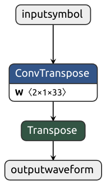

# NN-defined Modulator
## Overview
This is the code repository for paper *NN-Defined Modulator: Reconfigurable and Portable Software Modulator on IoT Gateways* in NSDI'24.
## Prerequisites
### Development Environment
The development requires `PyTorch` library and some other commonly-used python modules, like `SciPy`and `NumPy`.  
### Deployment Environment
The deloyment requires the `ONNX` and `ONNXRuntime` libraries. Besides, the SDR libraries depends on the SDR devices you use. 
  * For example, we use ADI PlutoSDR and it requires `libiio`() and `pyadi-iio` installed.
## Structure
The repository contains the majority of the implementation of NN-defined modulators. 
```bash
/
├── OFDM_Training.ipynb
├── QAM_Training.ipynb
├── TemplateForONNX.ipynb
├── TrainingWaveform/
│   ├── OFDM/
│   └── QAM/
├── CodeOnJetson/
│   ├── PlutoSDR_test.py
│   ├── WiFi/
│   ├── ZigBee/
│   └── Portability/
└── README.md
```
* All three `.ipynb` files in the root directory have the NN-defined modulator template, named as `ModulatorNet()`.
  * `ModulatorNet()` is implemented as a `torch.nn.module()`. The structure and the settings can be found in our paper.
* `QAM_Training.ipynb` and `OFDM_Training.ipynb` shows the training procedure of the NN-defined modulators. 
  * The training sets are located in `TrainingWaveform/`. They are generated by MATLAB.
* `TemplateForONXX.ipynb` demonstrates the portable design on how to export the `torch` models to `.onnx` models.
  * You can visualize the `.onnx` models with ***Netron*** tool. Here is an example of the simplified NN-defined QAM modulator.
<div align=center></div>

* `CodeOnJetson/` contains the files related to the portable deployment of NN-defined modualtors. 
  * `Potability/` contains the `.onnx` models of QAM and OFDM modulators as well as the corresponding input symbols for portability test.
  *  `WiFi/` and `ZigBee/` folders contain the evaluation files for Over-the-Air transmission using SDR front-end.
## Example Usage
### Training NN-defined modulators
The `QAM_Training`, `OFDM_Training` and `TemplateForONXX` are all Jupyter Notebooks. Run cells and get the results.
### Sending Over-the-Air
`PlutoSDR_test.py` is used to verify if the PlutoSDR is connected and working. The Python `.py` files can be run in the terminal like
```python
python PlutoSDR_test.py
```

After testing the SDR devices, you can run the OTA tests in `WiFi/` and `ZigBee/` folders like
```python
python SDR_ONNX_WiFi_beacon.py
```

For the purpose of debug, there are also notebook files in these folders.
